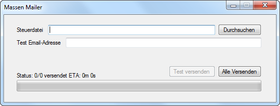

# Massen Mailer

  

##Achtung
Sie müssen den Source Code anpassen, um das Programm nutzen zu können. Die Stellen, an denen das nötig ist, wurden kommentiert.

##Inhalt
Hier finden Sie den Sourcecode für das Programm.

##Automatische Udaptes
Dieses Programm aktualisiert sich selbst bei jedem Start, ohne dass der User dafür eingreifen muss.

##Zweck
Die meisten Massen Mailer Tools sind komplett überladen, sodass die meisten Funktionen, die geboten werden, meistens nur dazu dienen, den Einstieg zu erschweren.

Dieser Mailer schafft dabei Abhilfe, indem es nur das nötigste bietet, sodass der Anwender performant und auf sehr einfachen Wege zum Ziel kommt.

Dabei ist es notwendig, dass die Daten mit dem richtigen Format vorliegen.